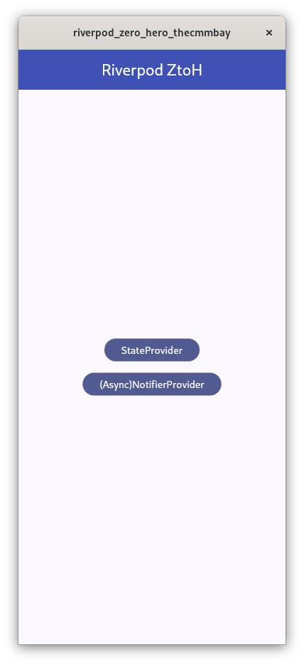
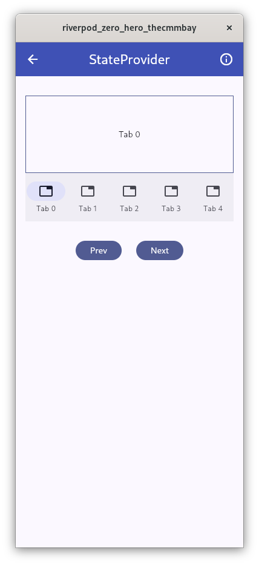
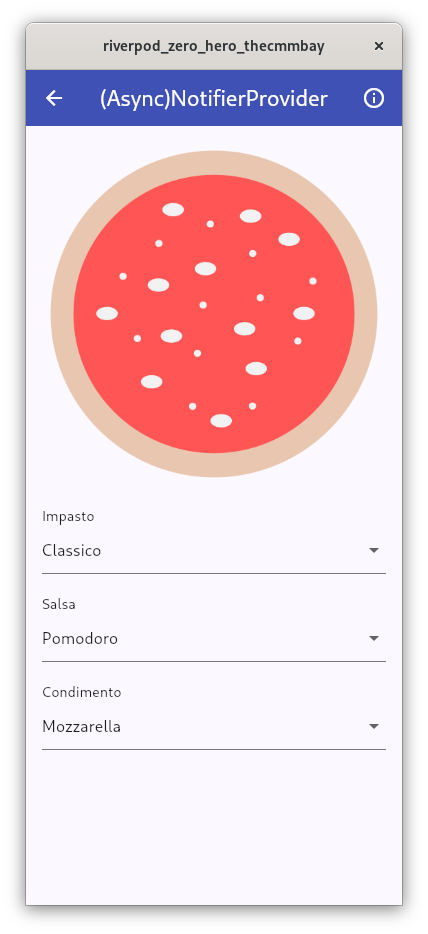

# Flutter Riverpod: gestione dello Stato da Zero a Hero

Questo repository contiene il codice dell'applicazione demo che ho realizzato per il talk [Flutter Riverpod: gestione dello Stato da Zero a Hero](https://thecmmbay.com/eventi/flutter-riverpod-gestione-dello-stato-da-zero-a-hero-ko7mkrjyw) per [The Communities Bay](https://thecmmbay.com/).

## Sommario

Sei uno sviluppatore interessato a Flutter e vuoi imparare a gestire lo stato delle tue applicazioni in modo efficiente? Allora non perdere il nostro entusiasmante evento dedicato al framework Flutter Riverpod!

Durante il talk, dopo un’introduzione a Riverpod, vedremo come questo permetta la gestione dello stato in Flutter attraverso l'uso dei provider, offrendoti tutti gli strumenti per sfruttare questi oggetti Dart nei tuoi progetti.

Che tu sia un principiante o un esperto di Flutter, questo talk ti fornirà conoscenze approfondite sulla gestione dello stato e ti aiuterà a migliorare le tue competenze e ad elevare le tue capacità di sviluppo.

In dettaglio, vedremo:

* Introduzione a Riverpod
* Provider
* StateProvider
* Notifier e AsyncNotifier
* FutureProvider e StreamProvider

*Questo evento non è affiliato, sponsorizzato o approvato da Google LLC. "Flutter" e "Dart" sono marchi registrati di Google LLC. I contenuti di questo evento sono puramente informativi ed educativi e non implicano alcuna associazione con le aziende menzionate.*

## Provider

Durante la presentazione mi sono occupato dei seguenti provider:

* [StateProvider](https://riverpod.dev/docs/providers/state_provider)
* [(Async)NotifierProvider](https://riverpod.dev/docs/providers/notifier_provider)

### Code Generation

Per semplificare la scrittura dei provider, è possibile sfruttare la code generation di Flutter. In questo progetto, è stata impiegata per realizzare il notifier provider, strutturato come segue:

```dart
part 'notifier_provider.g.dart';
@riverpod
class Pizza extends _$Pizza {
  @override
  MyPizza build() {
    return MyPizza(
        linkImpasto: impastoOptionList[0].link,
        linkCondimento: condimentoOptionList[0].link,
        linkSalsa: salsaOptionList[0].link);
  }

  void changeImpasto(String newImpastoLink) {
    state = state.copyWith(linkImpasto: newImpastoLink);
  }

  void changeSalsa(String newSalsaLink) {
    state = state.copyWith(linkSalsa: newSalsaLink);
  }

  void changeCondimento(String newCondimentoLink) {
    state = state.copyWith(linkCondimento: newCondimentoLink);
  }
}
```

Volendolo scrivere senza la code generation il risultato sarebbe questo:

```dart
class PizzaNotifier extends Notifier<MyPizza> {
  @override
  MyPizza build() {
    return MyPizza(
        linkImpasto: impastoOptionList[0].link,
        linkCondimento: condimentoOptionList[0].link,
        linkSalsa: salsaOptionList[0].link);
  }

  void changeImpasto(String newImpastoLink) {
    state = state.copyWith(linkImpasto: newImpastoLink);
  }

  void changeSalsa(String newSalsaLink) {
    state = state.copyWith(linkSalsa: newSalsaLink);
  }

  void changeCondimento(String newCondimentoLink) {
    state = state.copyWith(linkCondimento: newCondimentoLink);
  }
}

final pizzaProvider =
    NotifierProvider<PizzaNotifier, MyPizza>(() => PizzaNotifier());
```

### Approfondimenti e link

* [Slide della presentazione](slides/RiverpodZeroToHero-TheCommBay.pdf)
* [Documentazione di Riverpod](https://riverpod.dev/)
* [Flutter Riverpod 2.0: The Ultimate Guide](https://codewithandrea.com/articles/flutter-state-management-riverpod/)
* [Code Generation with Dart & Flutter: The Ultimate Guide](https://codewithandrea.com/articles/dart-flutter-code-generation/)

## 📱 Screenshots

| Homepage | StateProvider | Notifier |
|-|-|-|
||||


## 💎 Contribuire

Se trovate un errore, non esitate a segnalarlo come issue e a descriverlo nel modo migliore possibile.
Se vuoi contribuire con del codice, crea prima una issue.


## 📋 Licenza

Flutter Riverpod da Zero a Hero è rilasciato con [licenza MIT](LICENSE.md). È possibile utilizzare il codice per qualsiasi scopo, compresi i progetti commerciali.

[](https://opensource.org/licenses/MIT)
